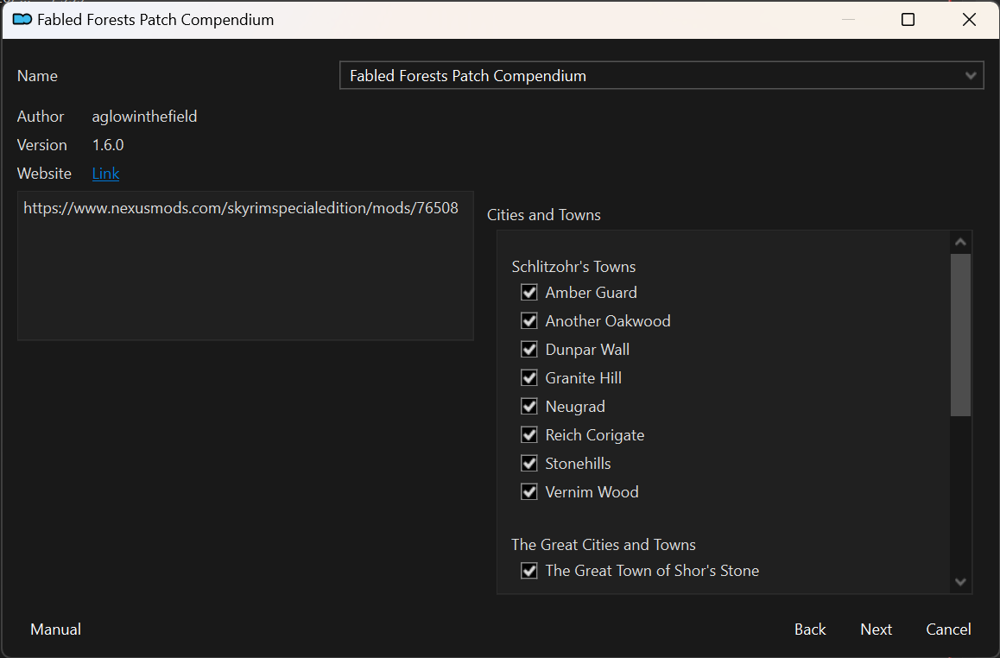

# This is a work in progress. Without a GitHub release available, clone at your own peril.


## Who is PrettyFOMOD for?
Mod creators and patch collection authors.

## What does PrettyFOMOD do?

**Currently:** Generates FOMOD code that makes your included ESPs auto-selected if the user has its masters installed. 

*What does that mean?*

Let's take a simple example. In the picture below, you have to manually create conditions for each of those checkboxes 
to be automatically checked. Typically your conditions are something like "Recommend if user has Fabled Forests and Amber Guard". 

Doing this all in the FOMOD creator, lovely though it may be, is time consuming and error-prone. 



## Requirements

At the moment you do still have to _create_ a FOMOD first, with the requisite steps, sub-steps, etc. You just don't need
to worry about writing suggestion logic.

That is, you will already have a `fomod\` folder.

In the future this tool will be able to generate a FOMOD based on a directory listing of files.

## Usage

*At time of writing, you have to clone the repository and build the project to generate an .exe. Once some more testing
is done there will be a GitHub release to download. If I forget to update the README, check the releases tab before 
building from source*

- Grab `PrettyFOMOD.exe`
- Place `PrettyFOMOD.exe` alongside your `fomod` folder for your mod/patch collection. Your directory structure should
look like this:

```text
mymod\
|--- fomod\
|--- PatchA.esp
|--- PatchB.esp
|--- PrettyFOMOD.exe
```
- Run PrettyFOMOD by double-clicking the exe or launching it from the CLI. Make sure to start it from the `mymod\` folder
if going the CLI route.

## NOTE
`PrettyFOMOD.exe` will overwrite your `ModuleConfig.xml` file with updated conditions. To prevent angry mobs of Bethesda modders
from storming my home, it will back up your previous XML file as `ModuleConfigBackup-{dateAndtime}.xml`. 